[](https://github.com/PERSIMUNE/MAIT/releases)  
[](https://hub.docker.com/r/danishdyna/mait_30092024gpu)  
 
[](https://github.com/PERSIMUNE/MAIT/blob/main/LICENSE)  
[](https://hits.seeyoufarm.com)
[](https://hits.seeyoufarm.com)
[](https://arxiv.org/abs/2501.04547)  
# MAIT - medical artificial intelligence toolbox

## Introduction
Welcome to the MAIT repository! This pipeline, implemented in Python, is designed to streamline your machine learning workflows using Jupyter Notebooks. It is compatible with both Windows and Linux operating systems. This repository also includes several tutorial notebooks to help you get started quickly. You can also refer to the `MANUAL` of MAIT for documentation. To overview MAIT's unique features and capabilities, we highly recommend reading the [MAIT preprint](https://arxiv.org/abs/2501.04547) on arXiv. If you use MAIT in your research, please remember to cite it in your publications.


## MAIT Workflow Overview

The MAIT framework provides a comprehensive machine learning pipeline for medical data analysis. The workflow consists of several interconnected stages, from data preprocessing to model interpretation:

```mermaid
flowchart TD
    %% Data Input Layer
    subgraph DataInput ["� Data Input Layer"]
        RawData[("Raw Medical Data<br/>CSV format<br/>Tabular structure")] 
        ExtData[("External Validation Data<br/>Independent test set<br/>Same feature structure")]
        ConfigFile[("Configuration Settings<br/>JSON parameters<br/>Streamlit interface")]
    end
    
    %% Data Preprocessing Layer
    subgraph Preprocessing ["🧹 Data Preprocessing Layer"]
        DataClean["Data Cleaning & Validation<br/>• Drop NaN outcome rows<br/>• Handle empty entries<br/>• Data type conversion"]
        MissingData["Handle Missing Values<br/>• KNN imputation<br/>• Filter high missingness<br/>• Column/row filtering"]
        OutlierDetect["Outlier Detection<br/>• Isolation Forest algorithm<br/>• Anomaly removal<br/>• Optional preprocessing"]
        RareCategories["Rare Categories Merging<br/>• Threshold: 5% default<br/>• 'Missing' category<br/>• String conversion"]
    end
    
    %% Data Split Layer
    subgraph DataSplit ["� Data Split Layer"]
        TrainSet[("Training Set (80%)<br/>Model development<br/>Cross-validation")] 
        TestSet[("Test Set (20%)<br/>Final evaluation<br/>Hold-out validation")] 
        ExtVal[("External Validation<br/>Independent dataset<br/>Real-world testing")]
    end
    
    %% Feature Engineering Layer
    subgraph FeatureEng ["⚙️ Feature Engineering Layer"]
        FeatureSelect["Feature Selection (mRMR)<br/>• Min-redundancy Max-relevance<br/>• Configurable num features<br/>• Mutual information"]
        DataScale["Data Scaling<br/>• Robust scaling method<br/>• Optional preprocessing<br/>• Numerical features"]
        Encoding["Categorical Encoding<br/>• One-hot encoding<br/>• String conversion<br/>• Handle categories"]
    end
    
    %% Model Training Layer
    subgraph ModelTraining ["Model Training Layer"]
        CVFolds["Cross-Validation (5-fold)<br/>• Stratified K-fold<br/>• Random state control<br/>• Performance estimation"]
        HPTuning["Hyperparameter Tuning<br/>• RandomizedSearchCV<br/>• 10 iterations default<br/>• ROC-AUC optimization"]
        ModelFit["Model Training<br/>• Class weight balancing<br/>• Sample weights<br/>• Fit-predict cycle"]
        ThresholdOpt["Threshold Optimization<br/>• Youden's J statistic<br/>• ROC curve analysis<br/>• Optimal cutoff"]
    end
    
    %% Available Models
    subgraph Models ["Available Models"]
        RF["Random Forest<br/>• n_estimators: 100-1000<br/>• max_depth: 3-10<br/>• Bootstrap sampling"]
        LGB["LightGBM<br/>• Gradient boosting<br/>• GPU support<br/>• GOSS algorithm"]
        CB["CatBoost<br/>• Categorical features<br/>• Ordered encoding<br/>• Symmetric trees"]
        QLattice["QLattice (Symbolic)<br/>• Feyn library<br/>• Mathematical expressions<br/>• Symbolic regression"]
        LR["Logistic Regression<br/>• Linear classification<br/>• L1/L2 regularization<br/>• Probability estimates"]
        NB["Naive Bayes<br/>• Gaussian distribution<br/>• Probabilistic classifier<br/>• No hyperparameters"]
        HGBC["Hist Gradient Boosting<br/>• Histogram-based<br/>• Fast performance<br/>• Large datasets"]
    end
    
    %% Model Evaluation Layer
    subgraph Evaluation ["� Model Evaluation Layer"]
        Performance["Performance Metrics<br/>• ROC-AUC & PR-AUC<br/>• MCC, F1-score<br/>• Sensitivity, Specificity"]
        BestModel["Best Model Selection<br/>• Mean CV performance<br/>• ROC-AUC ranking<br/>• Statistical comparison"]
        TestEval["Test Set Evaluation<br/>• Hold-out validation<br/>• Final performance<br/>• Generalization test"]
    end
    
    %% Model Interpretation Layer
    subgraph Interpretation ["� Model Interpretation Layer"]
        SHAP["SHAP Analysis<br/>• TreeExplainer<br/>• Feature contributions<br/>• Local explanations"]
        FeatureImp["Feature Importance<br/>• Permutation importance<br/>• Tree-based importance<br/>• Ranking analysis"]
        ModelExplain["Model Explainability<br/>• Global interpretations<br/>• Feature interactions<br/>• Decision paths"]
    end
    
    %% Results and Visualization Layer
    subgraph Results ["� Results & Visualization Layer"]
        ROCCurve["ROC Curves<br/>• Multi-model comparison<br/>• AUC visualization<br/>• Threshold analysis"]
        SHAPPlots["SHAP Plots<br/>• Summary plots<br/>• Decision plots<br/>• Feature contributions"]
        ConfMatrix["Confusion Matrix<br/>• Classification results<br/>• Error analysis<br/>• Threshold evaluation"]
        Reports["Performance Reports<br/>• Comprehensive metrics<br/>• Model comparisons<br/>• Export formats"]
    end
    
    %% Optional Advanced Analysis
    subgraph Advanced ["� Advanced Analysis (Optional)"]
        Survival["Survival Analysis<br/>• Random Survival Forest<br/>• Cox regression<br/>• Time-to-event modeling"]
        Regression["Regression Analysis<br/>• Random Forest Regressor<br/>• Linear regression<br/>• Continuous outcomes"]
        Calibration["Model Calibration<br/>• Probability calibration<br/>• Conformal predictions<br/>• Uncertainty quantification"]
    end
    
    %% Connections between layers
    DataInput --> Preprocessing
    Preprocessing --> DataSplit
    DataSplit --> FeatureEng
    FeatureEng --> ModelTraining
    ModelTraining --> Models
    Models --> Evaluation
    Evaluation --> Interpretation
    Interpretation --> Results
    Results --> Advanced
    
    %% Styling for better readability
    classDef dataInput fill:#bbdefb,stroke:#1565c0,stroke-width:2px,color:#0d47a1
    classDef preprocessing fill:#e1bee7,stroke:#7b1fa2,stroke-width:2px,color:#4a148c
    classDef models fill:#a5d6a7,stroke:#388e3c,stroke-width:2px,color:#1b5e20
    classDef interpretation fill:#ffe0b2,stroke:#ef6c00,stroke-width:2px,color:#bf360c
    classDef advanced fill:#f8bbd9,stroke:#c2185b,stroke-width:2px,color:#880e4f
    
    %% Apply classes to subgraphs and nodes
    class DataInput,RawData,ExtData,ConfigFile dataInput
    class Preprocessing,DataSplit,FeatureEng,ModelTraining,DataClean,MissingData,OutlierDetect,RareCategories,TrainSet,TestSet,ExtVal,FeatureSelect,DataScale,Encoding,CVFolds,HPTuning,ModelFit,ThresholdOpt preprocessing
    class Models,Evaluation,RF,LGB,CB,QLattice,LR,NB,HGBC,Performance,BestModel,TestEval models
    class Interpretation,Results,SHAP,FeatureImp,ModelExplain,ROCCurve,SHAPPlots,ConfMatrix,Reports interpretation
    class Advanced,Survival,Regression,Calibration advanced
```



### Key Features:
- **Multi-Modal Analysis**: Binary classification, survival analysis, and regression
- **Automated Pipeline**: Streamlined workflow from raw data to interpretable results
- **Explainable AI**: SHAP-based model interpretation and feature importance analysis
- **Multiple Algorithms**: Seven different machine learning models including tree-based, linear, and symbolic regression
- **Robust Validation**: Cross-validation, external validation, and comprehensive performance metrics
- **Advanced Analysis**: Optional survival analysis, regression modeling, and model calibration

### Technical Implementation Details

#### Data Processing Pipeline
- **Missing Data Handling**: KNN imputation with adaptive neighbor selection based on dataset size
- **Outlier Detection**: Isolation Forest algorithm with contamination auto-estimation
- **Categorical Processing**: One-hot encoding with rare category merging (5% threshold default)
- **Feature Selection**: mRMR (minimum Redundancy Maximum Relevance) algorithm with mutual information
- **Data Scaling**: Robust scaling method resistant to outliers using median and IQR

#### Model Training & Evaluation
- **Cross-Validation**: 5-fold stratified cross-validation with class balance preservation
- **Hyperparameter Tuning**: RandomizedSearchCV with 10 iterations for efficient parameter optimization
- **Performance Metrics**: Comprehensive evaluation including ROC-AUC, PR-AUC, MCC, F1-score, sensitivity, specificity, and Brier score
- **Threshold Optimization**: Youden's J statistic for optimal classification threshold selection
- **Model Selection**: Best model selection based on mean cross-validation performance

#### Machine Learning Models
| Model | Key Features | Hyperparameters |
|-------|-------------|----------------|
| **Random Forest** | Bootstrap sampling, feature randomness | n_estimators (100-1000), max_depth (3-10), min_samples_split |
| **LightGBM** | Gradient boosting, GPU support, GOSS algorithm | num_leaves, min_child_samples, learning_rate, regularization |
| **CatBoost** | Categorical features, ordered encoding, symmetric trees | learning_rate, depth, l2_leaf_reg, iterations |
| **QLattice** | Symbolic regression, mathematical expressions | n_epochs, max_complexity |
| **Logistic Regression** | Linear classification, L1/L2 regularization | C, max_iter, tolerance |
| **Naive Bayes** | Probabilistic classifier, no hyperparameters | N/A |
| **Hist Gradient Boosting** | Histogram-based, fast on large datasets | max_iter, learning_rate, max_depth, regularization |

#### Interpretability & Explainability
- **SHAP Analysis**: TreeExplainer for tree-based models with local and global explanations
- **Feature Importance**: Multiple methods including permutation importance and tree-based importance
- **Visualization**: Comprehensive plots including ROC curves, SHAP summary plots, decision plots, and confusion matrices
- **Model Calibration**: Probability calibration and conformal predictions for uncertainty quantification

#### Configuration Options
The pipeline supports extensive configuration through JSON files or the Streamlit interface:
- **Data Configuration**: File paths, outcome variables, categorical features, data splitting options
- **Model Selection**: Choose from 7 algorithms, configure hyperparameter tuning
- **Feature Engineering**: Feature selection, scaling, outlier removal, rare category handling
- **Training Parameters**: Cross-validation folds, CPU/GPU allocation, performance metrics
- **Output Settings**: Result folders, visualization formats, class labels

### MAIT Workflow - Process Flow

For a more detailed view of the decision points and process flow, here's the complete MAIT workflow as a flowchart:


This flowchart illustrates the complete decision-making process and shows how MAIT adapts to different analysis needs:

#### Key Decision Points:
- **Discovery vs. Prediction Mode**: Choose between exploration (cross-validation only) or prediction (train/test split)
- **Data Preprocessing Options**: Outlier removal, feature selection, data scaling
- **Model Selection**: Choose from 7 different machine learning algorithms
- **Advanced Analysis**: Optional survival analysis, regression modeling, or calibration
- **External Validation**: Apply trained models to independent datasets

## How to Use

### Step 1: Clone the Repository
First, clone this repository to your local machine using the following command:

```bash
git clone https://github.com/PERSIMUNE/MAIT.git
cd MAIT
```

### Step 2: Install Conda and Setup the Environment

There are different ways to create an environment to use MAIT.
Ensure that you have [Conda](https://docs.conda.io/projects/conda/en/latest/user-guide/install/index.html) installed. 

Create a new conda environment using the provided `environment.yml` file:

```bash
conda env create -f environment.yml
conda activate mait_py3_10_9
```
Or if you prefer to use `pip` to install the required packages, you can create a conda environment and install the dependencies using `pip`:

```bash
conda create --name mait_py3_10_9 python=3.10.9
conda activate mait_py3_10_9
pip install -r requirements.txt
```
Also you can try an updated Python version, and also use mlflow (experimental).

```bash
conda create -n mait_env python=3.12 \
  numpy pandas scikit-learn scipy matplotlib seaborn joblib lightgbm catboost ipykernel \
  imbalanced-learn mlflow shap scikit-survival -c conda-forge
conda activate mait_env
pip install feyn mrmr_selection survshap openpyxl
conda install protobuf=3.20.* -c conda-forge
pip install --upgrade mlflow
```
### Step 3: Using Docker
A Docker image is available for this pipeline. You can build and run the Docker container using the `Dockerfile` provided in the repository. Here are the steps:

1. Build the Docker image (or use the one that is already available: https://hub.docker.com/r/danishdyna/mait_30092024gpu):

    ```bash
    docker build -t mait_py3_10_9:latest .
    ```

2. Run the Docker container where your MAIT pipeline files are located:

    ```bash
    docker run -it --rm -p 8888:8888 mait_py3_10_9:latest
    ```
    or do this
    ```bash
    docker run  --gpus all -p 8888:8888 -v "$(pwd):/app" -it danishdyna/mait_30092024gpu /bin/bash
    ```

Inside the container, you should activate the conda environment using `activate the conda mait_py3_10_9_30092024gpu` then run this to initiate Jupyter Notebook: `jupyter notebook --ip=0.0.0.0 --port=8888 --no-browser --allow-root`.

You can also refer to the `environment.yml` file to understand the dependencies and create your Docker environment. If you run the Docker container on an HPC server or a remote computer you can use http://your_HPC_server_address:8888/ to get access to the Jupyter Notebook to run MAIT.


## Quick Start with Streamlit Configuration Interface

For new users who want to get started quickly without diving into Jupyter notebooks, MAIT includes a user-friendly **Streamlit web interface** for configuration:

### Try Online (No Installation Required)
**Access the live app at: https://maitconfig.streamlit.app/**

### Launch Locally
```bash
cd MAIT
./run_streamlit.sh
```

Or manually:
```bash
streamlit run streamlit_app.py
```

### Features
- **Interactive Configuration**: Set up your machine learning pipeline through an intuitive web interface
- **Demo Data Included**: Test MAIT immediately with built-in medical dataset
- **Ready-to-Run Scripts**: Generate complete Python scripts with your configurations pre-filled
- **No Manual Editing**: Generated scripts are ready to execute without any code modifications

### Quick Demo
1. Launch the Streamlit app
2. Click "Use Demo Data" in the Data Configuration section
3. Configure your preferred models and parameters
4. Generate and download your customized MAIT pipeline script

This interface is perfect for users who want to explore MAIT's capabilities before diving into the detailed Jupyter tutorial notebooks.

## Tutorials
The repository includes several Jupyter Notebooks that serve as tutorials. These notebooks cover various aspects of the pipeline and demonstrate how to use different components effectively. Below you can find a list of available tutorials:

1. [Tutorial 1: Prediction of antimicrobial resistance for Azithromycin](https://github.com/PERSIMUNE/MAIT/blob/main/Tutorials/MAIT_Tutorial_Azithromycin_pub.html)
2. [Tutorial 2: Prediction of antimicrobial resistance for Ciprofloxacin](https://github.com/PERSIMUNE/MAIT/blob/main/Tutorials/MAIT_Tutorial_Ciprofloxacin_pub.html)
3. [Tutorial 3: Prediction of Dementia](https://github.com/PERSIMUNE/MAIT/blob/main/Tutorials/MAIT_Tutorial_Dementia_pub.html)
4. [Tutorial 4: Prediction of Breast Cancer](https://github.com/PERSIMUNE/MAIT/blob/main/Tutorials/MAIT_Tutorial_BreastCancer_pub.html)

## How to Cite
Here's how to cite MAIT:

### **APA Style**
Zargari Marandi, R., Frahm, A. S., Lundgren, J., Murray, D. D., & Milojevic, M. (2025) "Medical artificial intelligence toolbox (MAIT): An explainable machine learning framework for binary classification, survival modelling, and regression analyses." arXiv preprint arXiv:2501.04547.

### **BibTeX**
```bibtex
@article{zargari2025mait,
  title={Medical artificial intelligence toolbox (MAIT): An explainable machine learning framework for binary classification, survival modelling, and regression analyses},
  author={Zargari Marandi, Ramtin and Frahm, Anne Svane and Lundgren, Jens and Murray, Daniel Dawson and Milojevic, Maja},
  journal={arXiv preprint arXiv:2501.04547},
  year={2025},
  url={https://arxiv.org/abs/2501.04547}
}
```

## License
This pipeline is free to use for research purposes. Please ensure you follow the licenses of the individual packages used within this pipeline. For more details, refer to the `LICENSE` file in the repository.

---

We hope you find this pipeline useful for your machine learning projects. If you encounter any issues or have any questions, feel free to open an issue on GitHub.

